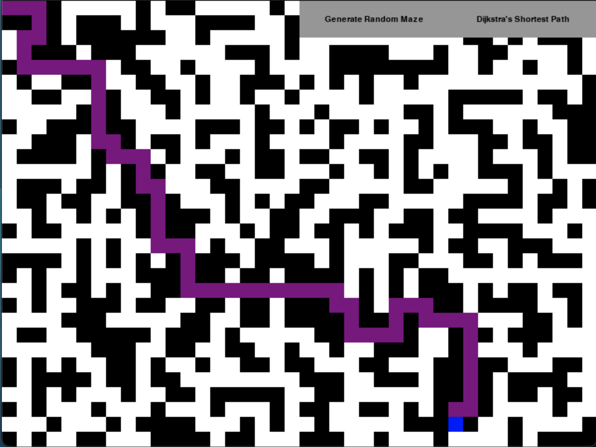

# MazeSolvingAlgorithms
Visualized Maze Solving Algorithms 

### How To Run
First we need to clone this repo. So for that run the following command.
```bash
git clone https://github.com/awa03/MazeSolvingAlgorithms.git my_maze_algorithms
```
Now enter the cloned directory
```bash
cd my_maze_algorithms
```
Now that we have entered the directory we can run the program. To do this run..
```bash
bash install_and_run.sh
```
This will install the dependencies as well as prompt the user to enter which visualization they would like to see. From this the chosen script is run.

> [!NOTE]
> The files were created using python3, so ensure that you have already downloaded the latest version of python in order to run this visualization

### Using The Program
When entering the project you will be granted a white screen with DFS or Shortest Path buttons in the top right. The user is allowed to place a red and a blue square down. These signify the start and end points. Following this the user is allowed to place black squares. This action creates walls. When the maze creation has been completed the user should press the algorithm button in the top right. An animation will play signifying the path that is currently being taken. For DFS the final path (pop paths removed) will be visualized in green. In Shortest Path the finished path will be shown in purple. 

### Having Fun
If you would like to have some fun with a larger maze to test the capability of the program try adjusting the number of cubes within the grid. This can be done by lowering--
```py
# Grid Size Lower to 1-10 for better results
# 1 - 6 may be difficult to see
# LINE 11 in code
GRID_SIZE = 2 
```
Editing the following line will speed up the animation
```py
# This may not change much if you have a large maze
pygame.time.set_timer(pygame.USEREVENT, 10)

# Try implementing this for faster results
#-----------------------------------------#
# Add a counter for animation updates
update_counter = 0

# Inside the main loop
while pq:
    # ...

    # Increment the update counter
    update_counter += 1

    if update_counter % 5 == 0:  # Update the display every 5 iterations (adjust as needed)
        draw_maze()
        pygame.display.flip()

```
****

# Depth-First-Search


# Dijkstra's algorithm


