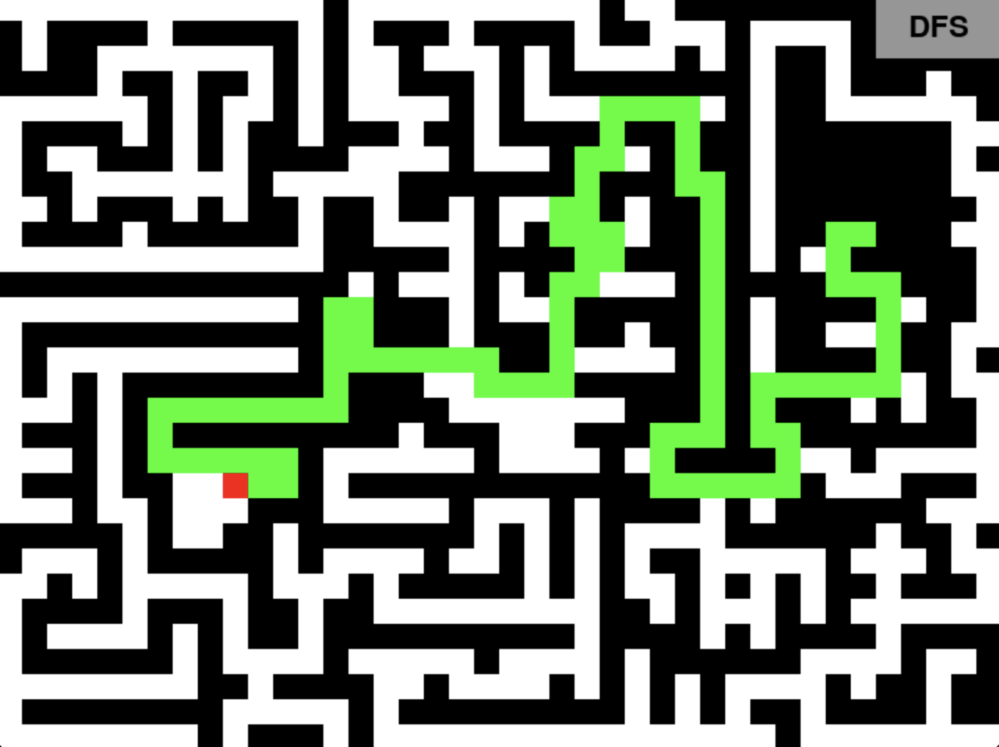

# MazeSolvingAlgorithms
Visualized Maze Solving Algorithms 

### How To Run
First we need to clone this repo. So for that run the following command.
```bash
git clone https://github.com/awa03/MazeSolvingAlgorithms.git my_maze_algorithms
```
Now enter the cloned directory
```bash
cd my_maze_algorithms
```
Now that we have entered the directory we can run the program. To do this run..
```bash
bash install_and_run.sh
```
This will install the dependencies as well as prompt the user to enter which visualization they would like to see. From this the chosen script is run.

> [!NOTE]
> The files were created using python3, so ensure that you have already downloaded the latest version of python in order to run this visualization

****

# Depth-First-Search


# Dijkstra's algorithm


